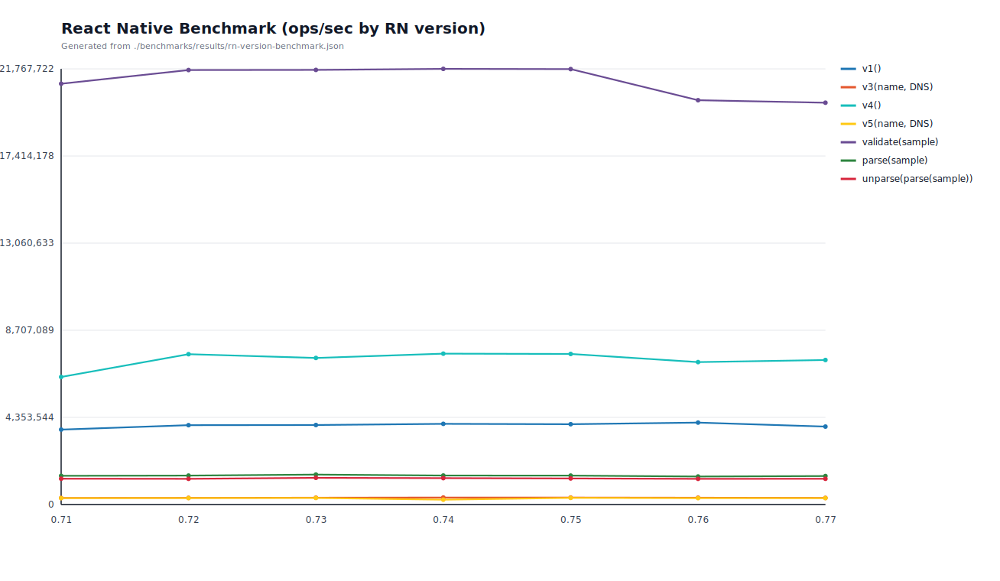
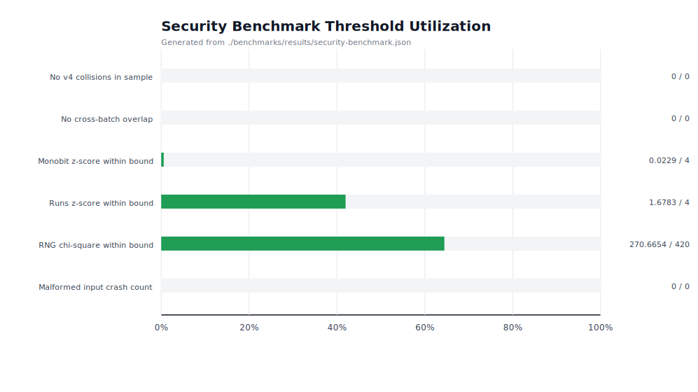
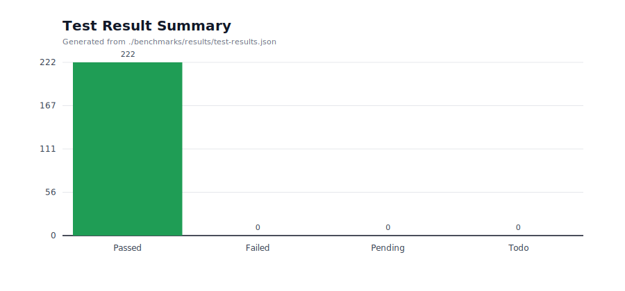

# react-native-uuid

[](./LICENSE)
[](https://www.npmjs.com/package/react-native-uuid)
[](https://npmcharts.com/compare/react-native-uuid?minimal=true)
[](https://npmcharts.com/compare/react-native-uuid?minimal=true)
[](https://github.com/eugenehp/react-native-uuid/watchers)
[](https://github.com/eugenehp/react-native-uuid/stargazers)
[](https://github.com/eugenehp/react-native-uuid/network/members)
[](https://github.com/eugenehp/react-native-uuid/issues?utf8=%E2%9C%93&q=is%3Aissue+is%3Aopen+label%3Abug)
[](https://github.com/eugenehp/react-native-uuid/issues)
[](https://github.com/eugenehp/react-native-uuid/pulls)

[](https://packagephobia.com/result?p=react-native-uuid)
[](https://bundlephobia.com/result?p=react-native-uuid@2.0.0)
[](https://github.com/eugenehp/react-native-uuid/actions/workflows/ci.yml)
[](https://nodejs.org/en/)
[](https://www.typescriptlang.org/)

`react-native-uuid` is a zero-dependency TypeScript implementation of [RFC4122](https://tools.ietf.org/html/rfc4122) standard **A Universally Unique IDentifier (UUID) URN Namespace**. Please note, this library uses pseudo random generator based on top of `Math.random`. New version with hardware support is WIP.

**Heavily inspired by:**

- [uuid](https://github.com/uuidjs/uuid)
- [pure-uuid](https://github.com/rse/pure-uuid)
- [nanoid](https://www.npmjs.com/package/nanoid)

Huge thanks to [Randy Coulman](https://github.com/randycoulman) for the early version of a code.

## Getting started

### Requirements

- **Node.js**: 18.0.0 or higher (16.x also supported)
- **npm**: 9.0.0 or higher

### Installation

```shell
npm install react-native-uuid
```

### Creating a UUID

```javascript
import uuid from 'react-native-uuid';
uuid.v4(); // ⇨ '11edc52b-2918-4d71-9058-f7285e29d894'
```

## Development

### Available Scripts

```bash
# Install dependencies
npm install

# Run tests
npm test
npm test -- --watch          # Watch mode
npm test -- --coverage       # With coverage report

# Linting and formatting
npm run lint                  # Lint TypeScript and JavaScript
npm run prettier:write        # Format all files
npm run prettier:check        # Check formatting without changes

# Building
npm run build                 # Build TypeScript to JavaScript
npm run prepublishOnly        # Build before publishing (auto on npm publish)

# Benchmarking
npm run bench:rn              # Generate benchmark matrix for RN 0.71 - 0.77
npm run bench:security        # Run security benchmark with pass/fail thresholds

# Documentation
npm run docs                  # Generate TypeDoc documentation
```

## Benchmarking

We keep a baseline benchmark matrix for major React Native versions:

- React Native: 0.71, 0.72, 0.73, 0.74, 0.75, 0.76, 0.77
- Cases: `v1`, `v3`, `v4`, `v5`, `validate`, `parse`, `unparse`
- Stored benchmark results: `benchmarks/results/rn-version-benchmark.md`
- Stored benchmark data: `benchmarks/results/rn-version-benchmark.json`
- Stored test report: `benchmarks/results/test-results.json`

Generate fresh results locally:

```bash
npm run bench:rn
npm test -- --runInBand --json --outputFile benchmarks/results/test-results.json
npm run bench:security
npm run bench:figures
```

### Charts





## Security Benchmarking

The security benchmark is designed as a pass/fail gate for randomness quality and misuse safety checks.

- Command: `npm run bench:security`
- Stored report: `benchmarks/results/security-benchmark.md`
- Stored data: `benchmarks/results/security-benchmark.json`
- CI workflow: `.github/workflows/security-benchmark.yml`

Current threshold gates:

- v4 sample collisions: `0`
- Cross-batch overlap (restart proxy): `0`
- Monobit test z-score: `<= 4`
- Runs test z-score: `<= 4`
- RNG chi-square score (256 bins): `<= 420`
- Malformed input crashes: `0`

The CI job fails if any threshold is exceeded.

## Documentation

Methods documentation is available [here](./docs/modules.md)

## Troubleshooting

Previous version has been based on `randombytes` that is not compatible with react-native out of the box.
Please submit an [issue](https://github.com/eugenehp/react-native-uuid/issues) if you found a bug.

## Contributing

See the [contributing guide](CONTRIBUTING.md) to learn how to contribute to the repository and the development workflow.

## Sponsorship

Thank you to our sponsors:

[](https://www.reactivelions.com)

## License

[MIT](./LICENSE)

Copyright (c) 2016-2026 Eugene Hauptmann
